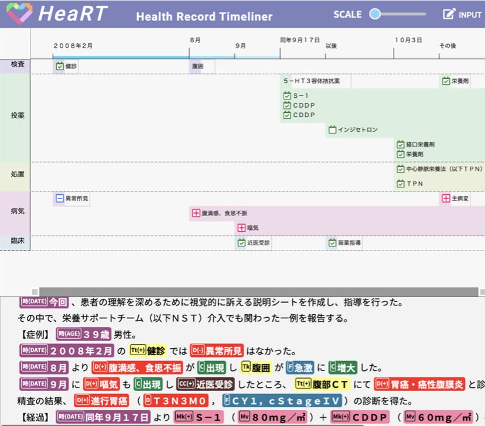

# HeaRT: Health Record Timeliner

臨床医学テキスト時系列可視化システム

電子カルテ等の臨床医学テキストに記載された医療情報を時系列（タイムライン）形式で可視化します．



## Docker での起動

Docker 環境があれば，`./Dockerfile` から HeaRT のコンテナを構築し，アプリを起動できます．

## 手動インストール

動作には、以下が必要です。

- python 3.8+
- npm

### javascript ライブラリのインストール

app.py の１つ下のフォルダに移動します

```
cd static
```

npm コマンドで javascript をインストールします

```
npm install
```

### python の仮想環境をインストール

以下のようなコマンドで　入っている python のバージョンをチェックします。  
環境に合わせて実施してください。

```
python3.8 -version
```

なるべく　 python3.8 以上を使用してください。(python3.6 でも動作するとは思います。)

もし、入っていない場合は、インストールします。

python のコマンドが python3.8 だとしたら、
以下のコマンドで python の仮想環境を作成します。
１度作成すれば次回からは省略します。

```
python3.8 -m venv myvenv
```

python の仮想環境に入ります。

```
source ./myvenv/bin/activate
```

python の仮想環境に入ると

(myvenv)　のような文字がプロンプトの前に表示されます。

ソースの　 requirements.txt 　がある位置までフォルダを移動して　ライブラリのインストール

```
pip install --upgrade pip
pip install -r requirements.txt
```

### サービスを起動

python 仮想環境下にて、以下のコマンドで Web サービスを起動

```
python app.py
```

以下にブラウザでアクセスします。

http://127.0.0.1:5000/

ただし、本番環境で使用する場合は、uWSGI 等を使用してください。

## データ

data フォルダに動作を確認している json が入っています。

## 設定ファイル

`static/js/heart.config.js`

下記の部分で，最初に本アプリを開いた時に表示される時系列を変更できます

```
//　コメントアウトにすると正気状態では空でスタート
var InitalFileJson="sample_input-3.json";
```

色等も　 heart.config.js 　で変更します。

API の URL は　 app.py の 15 行目あたりで指定しています。

```
API_URL = 'https://aoi.naist.jp/heart-api'

```

アップロードされたファイルは、app.py で指定しています。

```
UPLOAD_FOLDER = './uploads'
```

また，一部の URL はデプロイ環境に合わせて変える必要があります．

- `static/js/heart.js`
  - upload 処理のリンク先 `/upload` を修正する（例: `http://hostname.org/subpath` にこのアプリをデプロイしている場合， `/subpath/upload` にする必要がある）
  - input 処理 `/heart-api` を JaMIE の URL（上記 API_URL と同じもの）に変える
